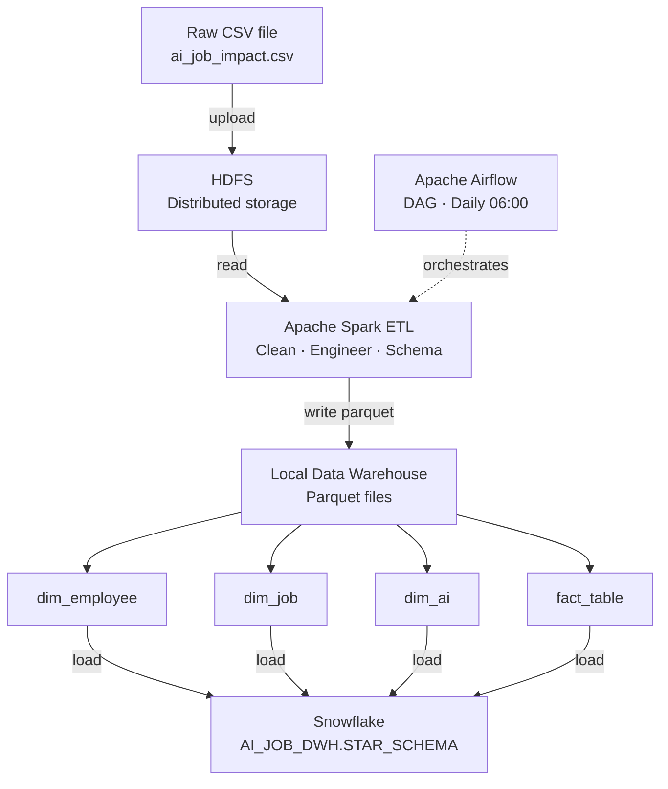
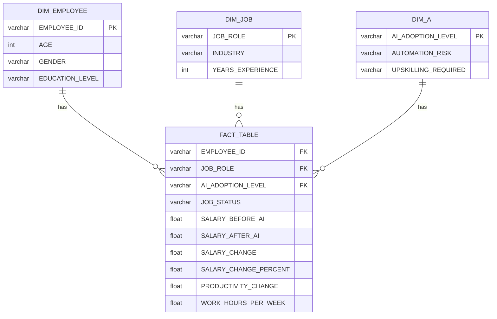

# 🤖 AI Job Impact — Big Data Pipeline

A production-grade data engineering pipeline that analyzes the impact of AI on employment using **Hadoop**, **Spark**, **Airflow**, and **Snowflake**.

---

## 🏗️ Architecture

```
Raw CSV → HDFS → Spark ETL → Local DWH (Parquet) → Snowflake
                                      ↑
                              Airflow (Orchestration)
```

| Layer | Technology | Role |
|-------|-----------|------|
| Storage | HDFS | Distributed raw data storage |
| Processing | Apache Spark | ETL, cleaning, feature engineering |
| Orchestration | Apache Airflow | DAG scheduling & monitoring |
| Data Warehouse | Parquet + Snowflake | Star schema storage |

---

## 📁 Repository Structure

```
├── dags/
│   └── ai_job_etl_dag.py        # Airflow DAG
├── data/
│   ├── raw/
│   │   └── ai_job_impact.csv    # Raw dataset
│   └── warehouse/               # Local Parquet tables
│       ├── dim_employee/
│       ├── dim_job/
│       ├── dim_ai/
│       └── fact_table/
├── notebooks/
│   └── ai_job_impact_etl.ipynb  # EDA & development notebook
├── ai_job.py                    # Main Spark ETL script
├── upload_to_snowflake.py       # Snowflake loader script
├── docker-compose.yaml          # Full stack infrastructure
└── README.md
```

---
## Architecture



## DWH Star Schema




| Table | Rows | Description |
|-------|------|-------------|
| `fact_table` | 2,000 | Core metrics per employee |
| `dim_employee` | 2,000 | Employee demographics |
| `dim_job` | 714 | Job roles & industries |
| `dim_ai` | 18 | AI adoption levels |

---

## 🚀 How to Run

### 1. Start the stack

```bash
docker-compose up -d
```

### 2. Run the ETL job

```bash
docker exec -it spark-jupyter bash
cd /home/jovyan/work
spark-submit ai_job.py
```

### 3. Load data to Snowflake

```bash
docker exec -it spark-jupyter python /home/jovyan/work/upload_to_snowflake.py
```

### 4. Access Airflow UI

```
URL:      http://localhost:18080
Username: airflow
Password: airflow
```

Enable the DAG `ai_job_impact_etl` and trigger a run.

---

## 🔄 Airflow DAG

**DAG ID:** `ai_job_impact_etl`  
**Schedule:** Daily at 06:00 AM

```
health_check → run_spark_etl → validate_output → notify_done
```

| Task | Description |
|------|-------------|
| `health_check` | Verifies spark-submit & data file exist |
| `run_spark_etl` | Executes the full Spark ETL pipeline |
| `validate_output` | Confirms all 4 warehouse tables were written |
| `notify_done` | Prints summary report |

---

## 🔧 Tech Stack

| Tool | Version | Purpose |
|------|---------|---------|
| Apache Spark | 3.x | Distributed data processing |
| Apache Airflow | 2.10.4 | Pipeline orchestration |
| Apache Hadoop | 3.2.1 | HDFS storage |
| Snowflake | Enterprise | Cloud data warehouse |
| Docker | Latest | Container infrastructure |
| Python | 3.11 | ETL scripting |

---

## 📊 ETL Pipeline Steps

1. **Ingest** — Read raw CSV from HDFS
2. **Clean** — Drop duplicates, fill nulls
3. **Feature Engineering** — Compute `Salary_Change`, `Salary_Change_Percent`
4. **Star Schema** — Split into 3 dimensions + 1 fact table
5. **Write** — Save as Parquet to local warehouse
6. **Validate** — Count rows by `Job_Status`
7. **Load** — Push all tables to Snowflake

---

## ✅ Validation Output

```
+----------+-----+
|Job_Status|count|
+----------+-----+
| Unchanged| 1093|
|  Replaced|  106|
|  Modified|  801|
+----------+-----+
```

---

## 👤 Author

**Ahmed Baalash**  
Data Engineering Project — Big Data Track
